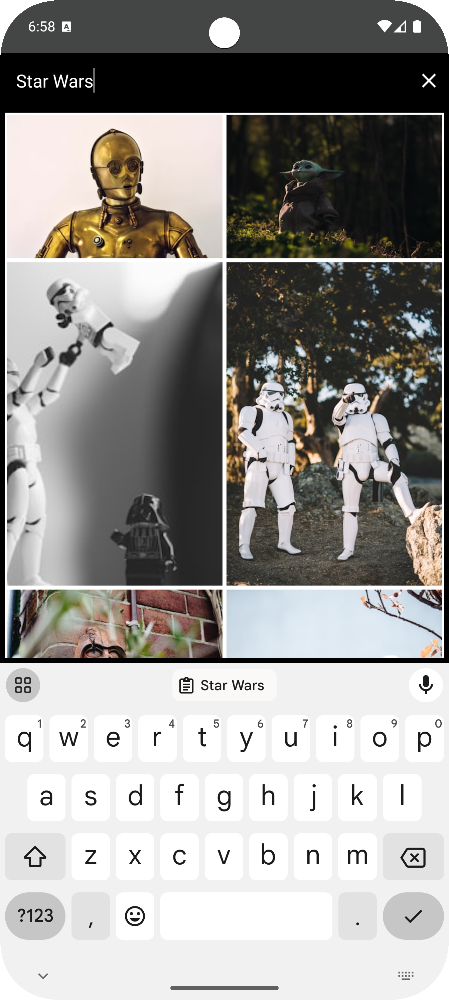

# 🌄 Unsplash Wallpapers (Java)

**Unsplash Wallpapers** is a personal project I developed as a test assignment during a job interview in 2019. The application allows users to discover, view, and set high-quality wallpapers from the Unsplash image service. This project showcases my expertise in Android development and the implementation of modern technologies.

---

## 📱 Key Features

- **Search and discover** beautiful images using the [Unsplash API](https://unsplash.com/documentation).
- **View images in detail**, including the ability to zoom in on images.
- **Set images as wallpapers** on your Android device with a single click.
- **Download images** directly to your device.
- **User-friendly and intuitive interface** for seamless interaction.

---

## 🛠️ Technologies Used

### Architecture

- **MVP (Model-View-Presenter)** – for separating app logic, improving testability, and enhancing maintainability.

### Programming Language

- **Java** – the primary language of the project.

### Core Libraries and Tools

- **Retrofit** – for REST API communication with the Unsplash API.
- **Picasso** – for image loading and display.
- **PhotoView** – for zooming and panning images.
- **RxJava** and **RxAndroid** – for reactive programming.
- **Room** – for local database storage.
- **Android Architecture Components** – including Lifecycle and LiveData.
- **ButterKnife** – for view binding and reducing boilerplate code.
- **Gson** – for JSON parsing.

### UI Components

- **Material Design** – for modern and attractive UI elements.
- **ConstraintLayout** – for flexible and optimized layouts.
- **RecyclerView** and **CardView** – for efficient list displays and card-based UI.

---

## 📂 Dependencies

The full list of dependencies is available in the `build.gradle` file.

---

## 📸 Application Screenshots

|  |  |
|---------------------------|---------------------------|
|  |  |
|  |  |
|  |  |

---

## 📅 About the Project

- Development Year: **2019**
- Project Type: **Test assignment for a job interview**
- Purpose: Demonstrate my expertise in Android development and popular libraries.

---

## 🚀 How to Run the Project

1. Clone the repository.
2. Register on [Unsplash](https://unsplash.com/) and obtain an API key.
3. Add the API key to `gradle.properties`:

   ```properties
   UNSPLASH_API_KEY=your_api_key_here
   ```

4. Build and run the project using Android Studio.

---

## 👨‍💻 About Me

**I am an Android developer** with experience working on diverse projects. This project was created as a test assignment to demonstrate my expertise and explore new technologies. I would be happy to hear your feedback or answer any questions! 😊

---